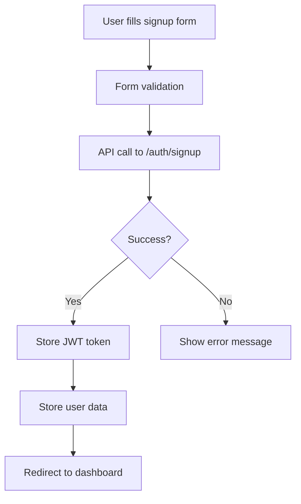
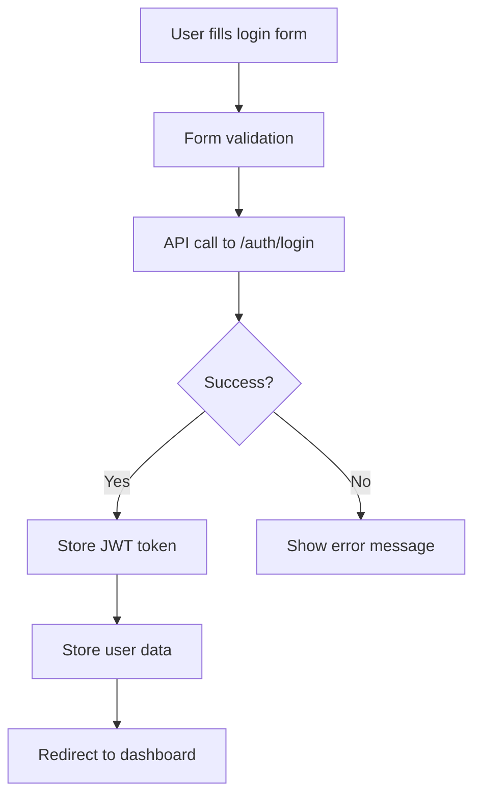
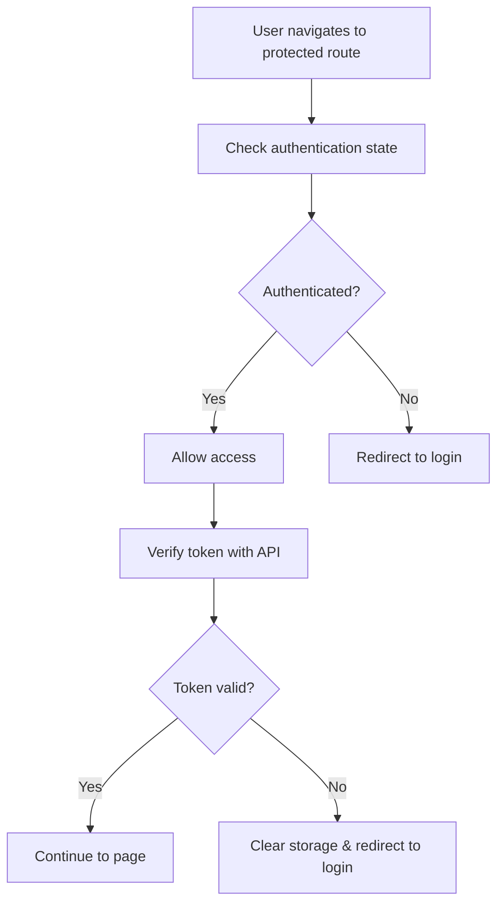

# Authentication System Documentation

This document explains the complete authentication system implementation for the CRM frontend application.

## Overview

The authentication system provides secure user login, registration, and session management with JWT token storage and automatic token refresh capabilities.

## Architecture

### Components

1. **AuthContext** - Global authentication state management
2. **AuthService** - API communication layer
3. **Login Page** - User authentication interface
4. **Signup Page** - User registration interface
5. **Protected Routes** - Route guards for authenticated users
6. **Navbar Integration** - User profile and logout functionality

## File Structure

```
src/
├── contexts/
│   └── AuthContext.jsx          # Global auth state management
├── services/
│   └── authService.js           # API service layer
├── pages/
│   ├── Login.jsx                # Login page component
│   └── Signup.jsx               # Registration page component
├── components/
│   └── Navbar.jsx               # Navigation with user profile
└── App.jsx                      # Main app with route protection
```

## Authentication Flow

### 1. User Registration (Signup)



### 2. User Login



### 3. Protected Route Access



## API Integration

### Base Configuration

```javascript
const api = axios.create({
  baseURL: 'http://localhost:8000/api',
  headers: {
    'Content-Type': 'application/json',
  },
});
```

### Authentication Endpoints

#### Login
- **Endpoint**: `POST /api/auth/login`
- **Payload**: `{ email, password }`
- **Response**: `{ access_token, user_id, email, full_name }`

#### Signup
- **Endpoint**: `POST /api/auth/signup`
- **Payload**: `{ email, password, full_name }`
- **Response**: `{ access_token, user_id, email, full_name }`

#### Get Current User
- **Endpoint**: `GET /api/auth/me`
- **Headers**: `Authorization: Bearer <token>`
- **Response**: `{ user_id, email, full_name, role }`

### Request/Response Interceptors

#### Request Interceptor
Automatically adds JWT token to all authenticated requests:

```javascript
api.interceptors.request.use((config) => {
  const token = localStorage.getItem('token');
  if (token) {
    config.headers.Authorization = `Bearer ${token}`;
  }
  return config;
});
```

#### Response Interceptor
Handles token expiration and automatic logout:

```javascript
api.interceptors.response.use(
  (response) => response,
  (error) => {
    if (error.response?.status === 401) {
      localStorage.removeItem('token');
      localStorage.removeItem('user');
      window.location.href = '/login';
    }
    return Promise.reject(error);
  }
);
```

## State Management

### AuthContext

The `AuthContext` provides global authentication state:

```javascript
const {
  user,           // Current user object
  isAuthenticated, // Boolean authentication status
  isLoading,      // Loading state for auth operations
  login,          // Login function
  signup,         // Signup function
  logout          // Logout function
} = useAuth();
```

### State Structure

```javascript
// User object structure
{
  id: "user-uuid",
  email: "user@example.com",
  full_name: "John Doe",
  role: "user" // or "admin", "manager"
}

// Authentication state
{
  user: userObject | null,
  isAuthenticated: boolean,
  isLoading: boolean
}
```

## UI Components

### Login Page Features

- **Beautiful Design**: Gradient background, centered card layout
- **Form Validation**: Real-time validation with error messages
- **Password Visibility**: Toggle password visibility
- **Loading States**: Spinner during authentication
- **Error Handling**: User-friendly error messages
- **Responsive**: Mobile-friendly design

### Signup Page Features

- **Comprehensive Form**: Full name, email, password, confirm password
- **Password Validation**: Minimum length and confirmation matching
- **Terms Acceptance**: Required checkbox for terms and conditions
- **Real-time Validation**: Immediate feedback on form errors
- **Professional UI**: Consistent with login page design

### Navigation Integration

- **User Profile**: Display user name and email
- **Logout Functionality**: Secure logout with token cleanup
- **Dropdown Menu**: Profile options and settings
- **Responsive Design**: Mobile-friendly navigation

## Security Features

### JWT Token Management

1. **Secure Storage**: Tokens stored in localStorage
2. **Automatic Inclusion**: Tokens automatically added to API requests
3. **Expiration Handling**: Automatic logout on token expiration
4. **Token Validation**: Server-side token verification

### Route Protection

1. **Protected Routes**: Authentication required for CRM pages
2. **Public Routes**: Login/signup accessible without authentication
3. **Automatic Redirects**: Smart routing based on auth status
4. **Loading States**: Proper loading indicators during auth checks

### Form Security

1. **Input Validation**: Client-side and server-side validation
2. **Password Requirements**: Minimum length enforcement
3. **Error Handling**: Secure error messages without sensitive data
4. **CSRF Protection**: Built-in axios security features

## Error Handling

### Client-Side Validation

```javascript
const validateForm = () => {
  if (formData.password !== formData.confirmPassword) {
    setError('Passwords do not match');
    return false;
  }
  if (formData.password.length < 6) {
    setError('Password must be at least 6 characters long');
    return false;
  }
  return true;
};
```

### API Error Handling

```javascript
try {
  const result = await login(email, password);
  if (result.success) {
    // Handle success
  } else {
    setError(result.error);
  }
} catch (error) {
  setError('An unexpected error occurred. Please try again.');
}
```

### Error Message Display

```jsx
{error && (
  <div className="bg-red-50 border border-red-200 rounded-lg p-4">
    <div className="flex">
      <ExclamationCircleIcon className="h-5 w-5 text-red-400" />
      <div className="ml-3">
        <p className="text-sm text-red-800">{error}</p>
      </div>
    </div>
  </div>
)}
```

## Usage Examples

### Using Authentication in Components

```javascript
import { useAuth } from '../contexts/AuthContext';

function MyComponent() {
  const { user, isAuthenticated, logout } = useAuth();
  
  if (!isAuthenticated) {
    return <div>Please log in</div>;
  }
  
  return (
    <div>
      <h1>Welcome, {user.full_name}!</h1>
      <button onClick={logout}>Logout</button>
    </div>
  );
}
```

### Making Authenticated API Calls

```javascript
import api from '../services/authService';

// The token is automatically included
const response = await api.get('/protected-endpoint');
```

### Manual Token Management

```javascript
import { authService } from '../services/authService';

// Check if user is authenticated
const isAuth = authService.isAuthenticated();

// Get current user
const user = authService.getStoredUser();

// Get token
const token = authService.getToken();

// Manual logout
authService.logout();
```

## Testing

### Manual Testing Checklist

1. **Registration Flow**:
   - [ ] Fill signup form with valid data
   - [ ] Verify password validation
   - [ ] Test successful registration
   - [ ] Test error handling for invalid data

2. **Login Flow**:
   - [ ] Fill login form with valid credentials
   - [ ] Test successful login
   - [ ] Test error handling for invalid credentials
   - [ ] Test password visibility toggle

3. **Route Protection**:
   - [ ] Access protected routes without authentication
   - [ ] Verify redirect to login page
   - [ ] Access protected routes with authentication
   - [ ] Verify successful access

4. **Session Management**:
   - [ ] Test automatic token refresh
   - [ ] Test logout functionality
   - [ ] Test token expiration handling
   - [ ] Test page refresh persistence

### Automated Testing

Consider implementing:
- **Unit Tests**: AuthContext and authService functions
- **Integration Tests**: API communication
- **E2E Tests**: Complete authentication flows
- **Security Tests**: Token handling and validation

## Configuration

### Environment Variables

```javascript
// API Base URL
const API_BASE_URL = process.env.REACT_APP_API_URL || 'http://localhost:8000/api';

// Token storage key
const TOKEN_KEY = 'crm_token';
const USER_KEY = 'crm_user';
```

### Customization Options

1. **Token Storage**: Switch from localStorage to sessionStorage or httpOnly cookies
2. **Error Messages**: Customize error message styling and content
3. **Validation Rules**: Modify password requirements and form validation
4. **UI Theme**: Customize colors, fonts, and styling
5. **Redirect Behavior**: Change default redirect routes

## Troubleshooting

### Common Issues

1. **CORS Errors**: Ensure backend CORS is configured for frontend domain
2. **Token Expiration**: Check token expiration time and refresh logic
3. **Storage Issues**: Verify localStorage is available and not blocked
4. **API Connection**: Ensure backend server is running and accessible
5. **Route Protection**: Verify route guards are properly implemented

### Debug Tools

```javascript
// Enable debug logging
localStorage.setItem('debug', 'auth:*');

// Check authentication state
console.log('Auth state:', { user, isAuthenticated, isLoading });

// Verify token
console.log('Token:', authService.getToken());
```

## Future Enhancements

### Planned Features

1. **Remember Me**: Persistent login across browser sessions
2. **Password Reset**: Forgot password functionality
3. **Two-Factor Authentication**: Additional security layer
4. **Social Login**: Google, GitHub, etc. integration
5. **Role-Based Access**: Fine-grained permission system
6. **Session Management**: Multiple device session control

### Performance Optimizations

1. **Lazy Loading**: Code splitting for auth components
2. **Token Refresh**: Automatic token renewal
3. **Caching**: User data caching strategies
4. **Offline Support**: Offline authentication state

This authentication system provides a robust, secure, and user-friendly foundation for the CRM application with room for future enhancements and customizations.
