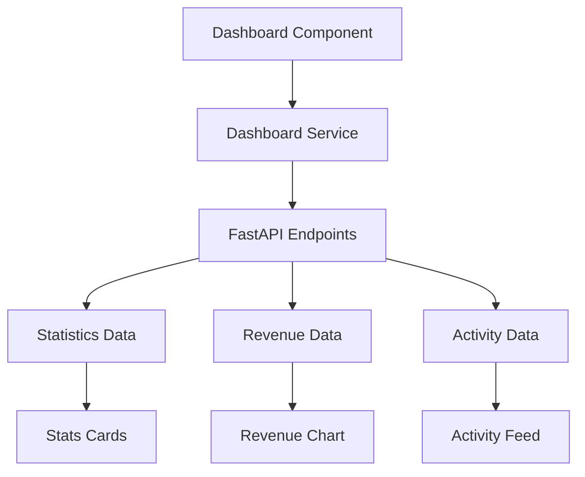

# Dashboard Implementation Documentation

This document explains the comprehensive Dashboard component implementation with real-time data fetching, charts, and activity feeds.

## Overview

The Dashboard provides a comprehensive overview of CRM metrics including summary statistics, revenue visualization, and recent activity tracking with real-time data from FastAPI endpoints.

## Features

### 📊 **Summary Statistics**
- **Total Leads**: Count with qualified leads breakdown
- **Total Deals**: Count with total value and closed deals
- **Total Tasks**: Count with completed tasks breakdown
- **Revenue**: Total revenue with closed deals count

### 📈 **Revenue Visualization**
- **Monthly Revenue Chart**: Interactive bar chart using Recharts
- **6-month trend**: Historical revenue data visualization
- **Responsive design**: Adapts to different screen sizes
- **Tooltip information**: Detailed revenue data on hover

### 🔄 **Recent Activity Feed**
- **Real-time updates**: Latest activities from all CRM modules
- **Activity types**: Create, update, delete, assign operations
- **Entity tracking**: Leads, deals, tasks, users
- **Timeline view**: Chronological activity display

### ⚡ **Quick Actions**
- **Direct navigation**: Links to create new records
- **Action buttons**: Add Lead, Create Deal, New Task, View Reports
- **Responsive grid**: Mobile-friendly button layout

## Architecture

### Components

```
Dashboard.jsx
├── Summary Statistics Cards
├── Revenue Chart (Recharts)
├── Recent Activity Feed
├── Quick Actions Panel
└── Recent Leads Table
```

### Data Flow



## API Integration

### Dashboard Service (`dashboardService.js`)

#### Statistics Endpoints
```javascript
// Get comprehensive dashboard statistics
GET /api/leads/stats
GET /api/deals/stats  
GET /api/tasks/stats
```

#### Activity Endpoints
```javascript
// Get recent activities
GET /api/activity/recent?limit=5
```

#### Revenue Data
```javascript
// Generate monthly revenue data
generateMonthlyRevenueData(months = 6)
```

### Data Structure

#### Statistics Response
```javascript
{
  leads: {
    total: 245,
    new: 45,
    qualified: 120
  },
  deals: {
    total: 89,
    total_value: 1250000,
    closed_won: 23
  },
  tasks: {
    total: 156,
    pending: 67,
    completed: 89
  }
}
```

#### Activity Response
```javascript
{
  activities: [
    {
      id: "uuid",
      entity_type: "lead",
      action: "create",
      performed_by: "user_id",
      timestamp: "2024-01-15T10:30:00Z",
      details: {
        description: "Created new lead",
        new_data: { ... }
      }
    }
  ]
}
```

#### Revenue Data
```javascript
[
  {
    month: "Jan",
    year: 2024,
    revenue: 75000,
    deals: 12,
    leads: 45
  }
]
```

## UI Components

### Statistics Cards

#### Features
- **Color-coded icons**: Different colors for each metric type
- **Trend indicators**: Up/down arrows with change values
- **Hover effects**: Subtle shadow on hover
- **Navigation links**: Direct links to detailed views

#### Card Types
```javascript
const statsCards = [
  {
    name: 'Total Leads',
    icon: UsersIcon,
    color: 'bg-blue-500',
    link: '/leads'
  },
  {
    name: 'Total Deals', 
    icon: CurrencyDollarIcon,
    color: 'bg-green-500',
    link: '/deals'
  },
  {
    name: 'Total Tasks',
    icon: ClipboardDocumentListIcon, 
    color: 'bg-yellow-500',
    link: '/tasks'
  },
  {
    name: 'Revenue',
    icon: ChartBarIcon,
    color: 'bg-purple-500',
    link: '/deals'
  }
];
```

### Revenue Chart

#### Recharts Integration
```jsx
<ResponsiveContainer width="100%" height={300}>
  <BarChart data={revenueData}>
    <CartesianGrid strokeDasharray="3 3" />
    <XAxis dataKey="month" />
    <YAxis tickFormatter={(value) => `$${(value / 1000).toFixed(0)}k`} />
    <Tooltip formatter={(value) => [formatCurrency(value), 'Revenue']} />
    <Bar dataKey="revenue" fill="#3B82F6" radius={[4, 4, 0, 0]} />
  </BarChart>
</ResponsiveContainer>
```

#### Chart Features
- **Responsive design**: Adapts to container width
- **Custom tooltips**: Formatted currency display
- **Rounded bars**: Modern visual design
- **Grid lines**: Clear data visualization
- **Y-axis formatting**: K notation for large numbers

### Activity Feed

#### Timeline Design
```jsx
<ul className="-mb-8">
  {recentActivity.map((activity, index) => (
    <li key={index}>
      <div className="relative pb-8">
        {/* Timeline connector */}
        {index !== recentActivity.length - 1 && (
          <span className="absolute left-4 top-4 -ml-px h-full w-0.5 bg-gray-200" />
        )}
        {/* Activity content */}
        <div className="relative flex space-x-3">
          <span className="h-8 w-8 rounded-full bg-primary-100 flex items-center justify-center">
            {getActivityIcon(activity.action)}
          </span>
          <div className="min-w-0 flex-1">
            {/* Activity details */}
          </div>
        </div>
      </div>
    </li>
  ))}
</ul>
```

#### Activity Types
- **Create**: ➕ New record creation
- **Update**: ✏️ Record modification
- **Delete**: 🗑️ Record deletion
- **Assign**: 👤 Assignment changes

#### Entity Colors
- **Lead**: Blue (`bg-blue-100 text-blue-800`)
- **Deal**: Green (`bg-green-100 text-green-800`)
- **Task**: Yellow (`bg-yellow-100 text-yellow-800`)
- **User**: Purple (`bg-purple-100 text-purple-800`)

## State Management

### Component State
```javascript
const [stats, setStats] = useState({
  leads: { total: 0, new: 0, qualified: 0 },
  deals: { total: 0, total_value: 0, closed_won: 0 },
  tasks: { total: 0, pending: 0, completed: 0 }
});
const [revenueData, setRevenueData] = useState([]);
const [recentActivity, setRecentActivity] = useState([]);
const [isLoading, setIsLoading] = useState(true);
const [error, setError] = useState(null);
```

### Data Fetching
```javascript
const fetchDashboardData = async () => {
  setIsLoading(true);
  setError(null);
  
  try {
    const [statsResult, revenueResult, activityResult] = await Promise.all([
      dashboardService.getDashboardStats(),
      dashboardService.getMonthlyRevenue(6),
      dashboardService.getRecentActivities(5)
    ]);
    
    // Update state with results
    if (statsResult.success) setStats(statsResult.data);
    if (revenueResult.success) setRevenueData(revenueResult.data);
    if (activityResult.success) setRecentActivity(activityResult.data.activities);
    
  } catch (error) {
    setError('Failed to load dashboard data');
  } finally {
    setIsLoading(false);
  }
};
```

## Error Handling

### Loading States
```jsx
if (isLoading) {
  return (
    <div className="flex items-center justify-center h-64">
      <div className="text-center">
        <div className="animate-spin rounded-full h-12 w-12 border-b-2 border-primary-600 mx-auto"></div>
        <p className="mt-4 text-gray-600">Loading dashboard...</p>
      </div>
    </div>
  );
}
```

### Error States
```jsx
if (error) {
  return (
    <div className="bg-red-50 border border-red-200 rounded-lg p-6">
      <div className="flex">
        <ExclamationTriangleIcon className="h-5 w-5 text-red-400" />
        <div className="ml-3">
          <h3 className="text-sm font-medium text-red-800">Error loading dashboard</h3>
          <p className="mt-1 text-sm text-red-700">{error}</p>
          <button onClick={fetchDashboardData} className="mt-3 btn-retry">
            <RefreshIcon className="h-4 w-4 mr-2" />
            Try Again
          </button>
        </div>
      </div>
    </div>
  );
}
```

## Responsive Design

### Grid Layouts
```css
/* Stats Cards */
grid-cols-1 gap-6 sm:grid-cols-2 lg:grid-cols-4

/* Content Grid */
grid-cols-1 gap-6 lg:grid-cols-2

/* Quick Actions */
grid-cols-1 gap-4 sm:grid-cols-2
```

### Mobile Optimization
- **Touch-friendly**: Large tap targets
- **Readable text**: Appropriate font sizes
- **Scrollable tables**: Horizontal scroll for data tables
- **Responsive charts**: Adapts to screen width

## Performance Optimizations

### Data Fetching
- **Parallel requests**: All API calls made simultaneously
- **Error isolation**: Individual endpoint failures don't break entire dashboard
- **Loading states**: User feedback during data fetching
- **Refresh capability**: Manual refresh button for updated data

### Rendering
- **Conditional rendering**: Only render when data is available
- **Memoization**: Prevent unnecessary re-renders
- **Lazy loading**: Components load as needed
- **Efficient updates**: Minimal state updates

## Customization

### Chart Customization
```javascript
// Customize chart colors
const chartColors = {
  primary: '#3B82F6',
  secondary: '#10B981',
  accent: '#F59E0B'
};

// Customize chart dimensions
const chartHeight = 300;
const chartMargin = { top: 20, right: 30, left: 20, bottom: 5 };
```

### Activity Feed Customization
```javascript
// Customize activity icons
const activityIcons = {
  create: '➕',
  update: '✏️',
  delete: '🗑️',
  assign: '👤'
};

// Customize activity colors
const activityColors = {
  lead: 'bg-blue-100 text-blue-800',
  deal: 'bg-green-100 text-green-800',
  task: 'bg-yellow-100 text-yellow-800'
};
```

## Testing

### Manual Testing Checklist
- [ ] **Data Loading**: Verify all statistics load correctly
- [ ] **Chart Rendering**: Check revenue chart displays properly
- [ ] **Activity Feed**: Confirm recent activities show
- [ ] **Error Handling**: Test error states and retry functionality
- [ ] **Responsive Design**: Test on different screen sizes
- [ ] **Navigation**: Verify quick action links work
- [ ] **Refresh**: Test manual refresh functionality

### Automated Testing
Consider implementing:
- **Unit Tests**: Component rendering and state management
- **Integration Tests**: API data fetching and error handling
- **Visual Tests**: Chart rendering and responsive design
- **E2E Tests**: Complete dashboard user flows

## Future Enhancements

### Planned Features
1. **Real-time Updates**: WebSocket integration for live data
2. **Custom Date Ranges**: User-selectable time periods
3. **Export Functionality**: PDF/Excel export of dashboard data
4. **Drill-down Capability**: Click to view detailed data
5. **Customizable Widgets**: User-configurable dashboard layout
6. **Advanced Charts**: Line charts, pie charts, heatmaps
7. **Performance Metrics**: Load time and API response monitoring

### Performance Improvements
1. **Data Caching**: Cache frequently accessed data
2. **Incremental Loading**: Load data as needed
3. **Virtual Scrolling**: Handle large activity lists
4. **Image Optimization**: Optimize chart rendering
5. **Bundle Splitting**: Code splitting for better performance

This Dashboard implementation provides a comprehensive, responsive, and performant overview of CRM data with real-time updates and beautiful visualizations.
