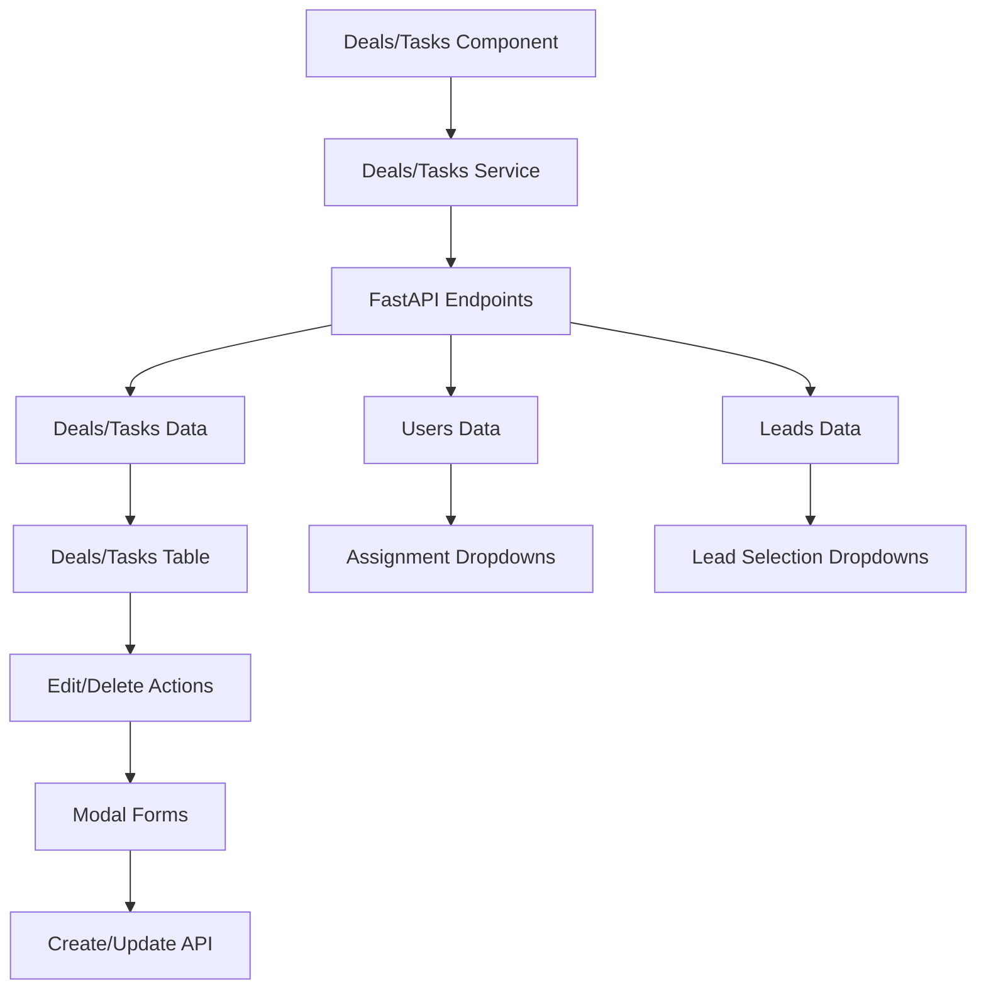

# Deals & Tasks Management Implementation Documentation

This document explains the comprehensive Deals and Tasks page implementations with responsive tables, CRUD modals, visual indicators, and backend integration.

## Overview

Both Deals and Tasks pages provide complete management capabilities including viewing, creating, editing, deleting, and assigning records with real-time data from FastAPI endpoints.

## Features

### 📊 **Deals Management**

#### **Deals Table**
- **Real-time Data**: Fetches deals from `/api/deals` endpoint
- **Responsive Design**: Mobile-friendly table with horizontal scroll
- **Stage Indicators**: Color-coded stage badges (Prospecting, Qualification, Proposal, etc.)
- **Value Display**: Currency formatting with dollar icon
- **Close Date Indicators**: Visual indicators for overdue, due today, and upcoming deals
- **Lead Integration**: Shows related lead information
- **User Assignment**: Inline dropdown for assigning deals to users

#### **Deals Search & Filtering**
- **Text Search**: Search by deal title
- **Stage Filter**: Filter by deal stage
- **User Filter**: Filter by assigned user
- **Real-time Updates**: Filters apply automatically with debouncing

#### **Deals CRUD Operations**
- **Create Deal**: Modal form with validation
- **Edit Deal**: Pre-populated form with existing data
- **Delete Deal**: Confirmation dialog with optimistic updates
- **Assign Deal**: Inline assignment dropdown

### 📋 **Tasks Management**

#### **Tasks Table**
- **Real-time Data**: Fetches tasks from `/api/tasks` endpoint
- **Responsive Design**: Mobile-friendly table with horizontal scroll
- **Type Indicators**: Color-coded type badges (Call, Email, Meeting, etc.)
- **Status Indicators**: Color-coded status badges (Pending, In Progress, Completed, etc.)
- **Due Date Indicators**: Visual indicators for overdue, due today, and upcoming tasks
- **Lead Integration**: Shows related lead information
- **User Assignment**: Inline dropdown for assigning tasks to users

#### **Tasks Search & Filtering**
- **Text Search**: Search by task title
- **Status Filter**: Filter by task status
- **Type Filter**: Filter by task type
- **User Filter**: Filter by assigned user
- **Real-time Updates**: Filters apply automatically with debouncing

#### **Tasks CRUD Operations**
- **Create Task**: Modal form with validation
- **Edit Task**: Pre-populated form with existing data
- **Delete Task**: Confirmation dialog with optimistic updates
- **Assign Task**: Inline assignment dropdown

## Architecture

### Components

```
Deals.jsx
├── Page Header with Add Button
├── Search & Filter Controls
├── Deals Data Table
├── Add/Edit Deal Modal
└── User Assignment Dropdowns

Tasks.jsx
├── Page Header with Add Button
├── Search & Filter Controls
├── Tasks Data Table
├── Add/Edit Task Modal
└── User Assignment Dropdowns
```

### Data Flow



## API Integration

### Deals Service (`dealsService.js`)

#### Core Endpoints
```javascript
// Get all deals with filtering
GET /api/deals?search=term&stage=proposal&assigned_to=user_id

// Get single deal
GET /api/deals/{deal_id}

// Create new deal
POST /api/deals

// Update existing deal
PUT /api/deals/{deal_id}

// Delete deal
DELETE /api/deals/{deal_id}

// Assign deal to user
PUT /api/deals/{deal_id}/assign

// Get deal statistics
GET /api/deals/stats

// Get deals by lead ID
GET /api/deals/lead/{lead_id}

// Get all users
GET /api/users

// Get all leads
GET /api/leads
```

### Tasks Service (`tasksService.js`)

#### Core Endpoints
```javascript
// Get all tasks with filtering
GET /api/tasks?search=term&status=pending&type=call&assigned_to=user_id

// Get single task
GET /api/tasks/{task_id}

// Create new task
POST /api/tasks

// Update existing task
PUT /api/tasks/{task_id}

// Delete task
DELETE /api/tasks/{task_id}

// Assign task to user
PUT /api/tasks/{task_id}/assign

// Get upcoming tasks
GET /api/tasks/upcoming?days=7

// Get task statistics
GET /api/tasks/stats

// Get tasks by lead ID
GET /api/tasks/lead/{lead_id}

// Get all users
GET /api/users

// Get all leads
GET /api/leads
```

## Data Structures

### Deal Object
```javascript
{
  id: "uuid",
  title: "Enterprise Software License",
  value: 50000.00,
  stage: "proposal", // prospecting, qualification, proposal, negotiation, closed_won, closed_lost
  close_date: "2024-02-15T00:00:00Z",
  lead_id: "uuid",
  assigned_to: "uuid",
  notes: "Additional notes",
  created_at: "2024-01-15T10:30:00Z",
  lead: {
    id: "uuid",
    name: "John Smith",
    company: "Acme Corp"
  }
}
```

### Task Object
```javascript
{
  id: "uuid",
  title: "Follow up with John Smith",
  type: "call", // call, email, meeting, follow_up, demo, proposal, other
  due_date: "2024-01-20T00:00:00Z",
  status: "pending", // pending, in_progress, completed, cancelled
  lead_id: "uuid",
  assigned_to: "uuid",
  notes: "Additional notes",
  created_at: "2024-01-15T10:30:00Z",
  lead: {
    id: "uuid",
    name: "John Smith",
    company: "Acme Corp"
  }
}
```

## Visual Indicators

### Deal Stage Indicators
```javascript
const stageOptions = [
  { value: 'prospecting', label: 'Prospecting', color: 'bg-gray-100 text-gray-800' },
  { value: 'qualification', label: 'Qualification', color: 'bg-blue-100 text-blue-800' },
  { value: 'proposal', label: 'Proposal', color: 'bg-yellow-100 text-yellow-800' },
  { value: 'negotiation', label: 'Negotiation', color: 'bg-orange-100 text-orange-800' },
  { value: 'closed_won', label: 'Closed Won', color: 'bg-green-100 text-green-800' },
  { value: 'closed_lost', label: 'Closed Lost', color: 'bg-red-100 text-red-800' }
];
```

### Task Type Indicators
```javascript
const typeOptions = [
  { value: 'call', label: 'Call', color: 'bg-green-100 text-green-800' },
  { value: 'email', label: 'Email', color: 'bg-blue-100 text-blue-800' },
  { value: 'meeting', label: 'Meeting', color: 'bg-purple-100 text-purple-800' },
  { value: 'follow_up', label: 'Follow Up', color: 'bg-orange-100 text-orange-800' },
  { value: 'demo', label: 'Demo', color: 'bg-indigo-100 text-indigo-800' },
  { value: 'proposal', label: 'Proposal', color: 'bg-pink-100 text-pink-800' },
  { value: 'other', label: 'Other', color: 'bg-gray-100 text-gray-800' }
];
```

### Task Status Indicators
```javascript
const statusOptions = [
  { value: 'pending', label: 'Pending', color: 'bg-yellow-100 text-yellow-800' },
  { value: 'in_progress', label: 'In Progress', color: 'bg-blue-100 text-blue-800' },
  { value: 'completed', label: 'Completed', color: 'bg-green-100 text-green-800' },
  { value: 'cancelled', label: 'Cancelled', color: 'bg-red-100 text-red-800' }
];
```

### Due Date Indicators

#### Deal Close Date Indicators
```javascript
const getCloseDateIndicator = (closeDate) => {
  const days = getDaysUntilClose(closeDate);
  if (days === null) return null;
  
  if (days < 0) {
    return { text: 'Overdue', color: 'text-red-600 bg-red-50' };
  } else if (days === 0) {
    return { text: 'Due Today', color: 'text-orange-600 bg-orange-50' };
  } else if (days <= 7) {
    return { text: `${days} days left`, color: 'text-yellow-600 bg-yellow-50' };
  } else {
    return { text: `${days} days left`, color: 'text-green-600 bg-green-50' };
  }
};
```

#### Task Due Date Indicators
```javascript
const getDueDateIndicator = (dueDate, status) => {
  if (status === 'completed') return null;
  
  const days = getDaysUntilDue(dueDate);
  if (days === null) return null;
  
  if (days < 0) {
    return { text: 'Overdue', color: 'text-red-600 bg-red-50', icon: ExclamationCircleIcon };
  } else if (days === 0) {
    return { text: 'Due Today', color: 'text-orange-600 bg-orange-50', icon: ClockIcon };
  } else if (days <= 3) {
    return { text: `${days} days left`, color: 'text-yellow-600 bg-yellow-50', icon: ClockIcon };
  } else {
    return { text: `${days} days left`, color: 'text-green-600 bg-green-50', icon: CheckCircleIcon };
  }
};
```

## UI Components

### Responsive Tables

#### Deals Table Structure
```jsx
<table className="min-w-full divide-y divide-gray-200">
  <thead className="bg-gray-50">
    <tr>
      <th>Deal</th>
      <th>Value</th>
      <th>Stage</th>
      <th>Close Date</th>
      <th>Lead</th>
      <th>Assigned To</th>
      <th>Actions</th>
    </tr>
  </thead>
  <tbody>
    {deals.map(deal => (
      <tr key={deal.id}>
        {/* Deal data cells with visual indicators */}
      </tr>
    ))}
  </tbody>
</table>
```

#### Tasks Table Structure
```jsx
<table className="min-w-full divide-y divide-gray-200">
  <thead className="bg-gray-50">
    <tr>
      <th>Task</th>
      <th>Type</th>
      <th>Status</th>
      <th>Due Date</th>
      <th>Lead</th>
      <th>Assigned To</th>
      <th>Actions</th>
    </tr>
  </thead>
  <tbody>
    {tasks.map(task => (
      <tr key={task.id}>
        {/* Task data cells with visual indicators */}
      </tr>
    ))}
  </tbody>
</table>
```

### Search & Filter Controls

#### Multi-Filter Layout
```jsx
<div className="flex flex-col sm:flex-row gap-4">
  <div className="flex-1">
    <div className="relative">
      <MagnifyingGlassIcon className="absolute left-3 top-1/2 transform -translate-y-1/2 h-5 w-5 text-gray-400" />
      <input
        type="text"
        placeholder="Search..."
        className="input pl-10"
        value={searchTerm}
        onChange={(e) => setSearchTerm(e.target.value)}
      />
    </div>
  </div>
  <div className="flex gap-2">
    <select className="input" value={filterStage} onChange={(e) => setFilterStage(e.target.value)}>
      <option value="all">All Stages</option>
      {stageOptions.map(option => (
        <option key={option.value} value={option.value}>{option.label}</option>
      ))}
    </select>
    <select className="input" value={filterAssignedTo} onChange={(e) => setFilterAssignedTo(e.target.value)}>
      <option value="all">All Users</option>
      {users.map(user => (
        <option key={user.id} value={user.id}>{user.full_name}</option>
      ))}
    </select>
  </div>
</div>
```

### CRUD Modals

#### Modal Structure
```jsx
<div className="fixed inset-0 z-50 overflow-y-auto">
  <div className="flex items-center justify-center min-h-screen">
    <div className="fixed inset-0 bg-gray-500 bg-opacity-75" />
    <div className="inline-block align-bottom bg-white rounded-lg shadow-xl">
      <form onSubmit={handleSubmit}>
        <div className="bg-white px-4 pt-5 pb-4">
          {/* Form fields */}
        </div>
        <div className="bg-gray-50 px-4 py-3 sm:flex sm:flex-row-reverse">
          {/* Action buttons */}
        </div>
      </form>
    </div>
  </div>
</div>
```

#### Form Fields

##### Deal Form Fields
- **Title** (required): Text input with validation
- **Value** (required): Number input with currency icon
- **Stage** (required): Dropdown with predefined options
- **Close Date**: Date input
- **Related Lead**: Dropdown populated with leads
- **Assign To**: Dropdown populated with users
- **Notes**: Textarea for additional information

##### Task Form Fields
- **Title** (required): Text input with validation
- **Type** (required): Dropdown with predefined options
- **Status** (required): Dropdown with predefined options
- **Due Date**: Date input
- **Related Lead**: Dropdown populated with leads
- **Assign To**: Dropdown populated with users
- **Notes**: Textarea for additional information

### User Assignment Dropdowns

#### Inline Assignment
```jsx
<select
  value={deal.assigned_to || ''}
  onChange={(e) => handleAssignDeal(deal.id, e.target.value)}
  className="text-sm border-0 bg-transparent focus:ring-0 focus:outline-none"
>
  <option value="">Unassigned</option>
  {users.map(user => (
    <option key={user.id} value={user.id}>
      {user.full_name}
    </option>
  ))}
</select>
```

## State Management

### Component State
```javascript
const [deals, setDeals] = useState([]);
const [users, setUsers] = useState([]);
const [leads, setLeads] = useState([]);
const [isLoading, setIsLoading] = useState(true);
const [error, setError] = useState(null);

// Search and filter states
const [searchTerm, setSearchTerm] = useState('');
const [filterStage, setFilterStage] = useState('all');
const [filterAssignedTo, setFilterAssignedTo] = useState('all');

// Modal states
const [isModalOpen, setIsModalOpen] = useState(false);
const [isEditMode, setIsEditMode] = useState(false);
const [selectedDeal, setSelectedDeal] = useState(null);
const [isSubmitting, setIsSubmitting] = useState(false);

// Form states
const [formData, setFormData] = useState({
  title: '',
  value: '',
  stage: 'prospecting',
  close_date: '',
  lead_id: '',
  assigned_to: '',
  notes: ''
});
const [formErrors, setFormErrors] = useState({});
```

### Data Fetching
```javascript
const fetchDeals = async () => {
  try {
    const params = { include_lead: true };
    if (searchTerm) params.search = searchTerm;
    if (filterStage !== 'all') params.stage = filterStage;
    if (filterAssignedTo !== 'all') params.assigned_to = filterAssignedTo;
    
    const result = await dealsService.getDeals(params);
    if (result.success) {
      setDeals(result.data.deals || []);
    } else {
      setError(result.error);
    }
  } catch (error) {
    setError('Failed to fetch deals');
  } finally {
    setIsLoading(false);
  }
};
```

## Form Validation

### Client-side Validation
```javascript
const validateForm = () => {
  const errors = {};
  
  if (!formData.title.trim()) {
    errors.title = 'Title is required';
  }
  
  if (!formData.value || formData.value <= 0) {
    errors.value = 'Value must be greater than 0';
  }
  
  if (!formData.stage) {
    errors.stage = 'Stage is required';
  }
  
  setFormErrors(errors);
  return Object.keys(errors).length === 0;
};
```

### Error Display
```jsx
{formErrors.title && (
  <p className="mt-1 text-sm text-red-600">{formErrors.title}</p>
)}
```

## CRUD Operations

### Create Operations
```javascript
const handleSubmit = async (e) => {
  e.preventDefault();
  
  if (!validateForm()) return;
  
  setIsSubmitting(true);
  
  try {
    let result;
    if (isEditMode) {
      result = await dealsService.updateDeal(selectedDeal.id, formData);
    } else {
      result = await dealsService.createDeal(formData);
    }
    
    if (result.success) {
      setIsModalOpen(false);
      fetchDeals();
    } else {
      setFormErrors({ submit: result.error });
    }
  } catch (error) {
    setFormErrors({ submit: 'An unexpected error occurred' });
  } finally {
    setIsSubmitting(false);
  }
};
```

### Update Operations
```javascript
const handleEditDeal = (deal) => {
  setIsEditMode(true);
  setSelectedDeal(deal);
  setFormData({
    title: deal.title || '',
    value: deal.value || '',
    stage: deal.stage || 'prospecting',
    close_date: deal.close_date ? deal.close_date.split('T')[0] : '',
    lead_id: deal.lead_id || '',
    assigned_to: deal.assigned_to || '',
    notes: deal.notes || ''
  });
  setFormErrors({});
  setIsModalOpen(true);
};
```

### Delete Operations
```javascript
const handleDeleteDeal = async (dealId) => {
  if (!window.confirm('Are you sure you want to delete this deal?')) {
    return;
  }

  try {
    const result = await dealsService.deleteDeal(dealId);
    if (result.success) {
      setDeals(deals.filter(deal => deal.id !== dealId));
    } else {
      setError(result.error);
    }
  } catch (error) {
    setError('Failed to delete deal');
  }
};
```

### Assignment Operations
```javascript
const handleAssignDeal = async (dealId, userId) => {
  try {
    const result = await dealsService.assignDeal(dealId, userId);
    if (result.success) {
      setDeals(deals.map(deal => 
        deal.id === dealId 
          ? { ...deal, assigned_to: userId }
          : deal
      ));
    } else {
      setError(result.error);
    }
  } catch (error) {
    setError('Failed to assign deal');
  }
};
```

## Search & Filtering

### Debounced Search
```javascript
useEffect(() => {
  const timeoutId = setTimeout(() => {
    fetchDeals();
  }, 300);
  return () => clearTimeout(timeoutId);
}, [searchTerm, filterStage, filterAssignedTo]);
```

### Filter Parameters
```javascript
const params = { include_lead: true };
if (searchTerm) params.search = searchTerm;
if (filterStage !== 'all') params.stage = filterStage;
if (filterAssignedTo !== 'all') params.assigned_to = filterAssignedTo;
```

## Error Handling

### Loading States
```jsx
if (isLoading) {
  return (
    <div className="flex items-center justify-center h-64">
      <div className="text-center">
        <div className="animate-spin rounded-full h-12 w-12 border-b-2 border-primary-600 mx-auto"></div>
        <p className="mt-4 text-gray-600">Loading deals...</p>
      </div>
    </div>
  );
}
```

### Error Display
```jsx
{error && (
  <div className="bg-red-50 border border-red-200 rounded-lg p-4">
    <div className="flex">
      <ExclamationTriangleIcon className="h-5 w-5 text-red-400" />
      <div className="ml-3">
        <p className="text-sm text-red-800">{error}</p>
      </div>
    </div>
  </div>
)}
```

## Responsive Design

### Mobile Optimization
- **Horizontal Scroll**: Tables scroll horizontally on mobile
- **Touch-friendly**: Large tap targets for buttons
- **Responsive Modal**: Modal adapts to screen size
- **Stacked Filters**: Filters stack vertically on mobile
- **Mobile Navigation**: Optimized for touch interaction

### Grid Layouts
```css
/* Filter controls */
flex-col sm:flex-row gap-4

/* Form fields */
grid-cols-2 gap-4

/* Action buttons */
flex items-center justify-end space-x-2
```

## Performance Optimizations

### Efficient Data Handling
- **Debounced Search**: Prevents excessive API calls
- **Parallel Requests**: Fetch deals/tasks, users, and leads simultaneously
- **Optimistic Updates**: Immediate UI updates for better UX
- **Error Recovery**: Retry failed operations
- **Loading States**: User feedback during operations

### Smart Filtering
- **Client-side Debouncing**: 300ms delay on search input
- **Combined Filters**: Multiple filters work together
- **Real-time Updates**: Instant filtering results
- **URL Parameters**: Filter state could be persisted in URL

## Testing

### Manual Testing Checklist
- [ ] **Data Loading**: Verify deals/tasks load correctly
- [ ] **Search Functionality**: Test text search across fields
- [ ] **Filter Operations**: Test stage/status, type, and user filters
- [ ] **Add Record**: Test creating new deals/tasks
- [ ] **Edit Record**: Test updating existing records
- [ ] **Delete Record**: Test deletion with confirmation
- [ ] **User Assignment**: Test assigning/unassigning records
- [ ] **Form Validation**: Test required field validation
- [ ] **Error Handling**: Test error states and recovery
- [ ] **Responsive Design**: Test on different screen sizes
- [ ] **Visual Indicators**: Test stage/status colors and due date indicators

### Automated Testing
Consider implementing:
- **Unit Tests**: Component rendering and state management
- **Integration Tests**: API communication and CRUD operations
- **Form Tests**: Validation and submission logic
- **E2E Tests**: Complete user workflows

## Future Enhancements

### Planned Features
1. **Bulk Operations**: Select multiple records for bulk actions
2. **Advanced Filters**: Date range, custom fields, tags
3. **Export Functionality**: Export to CSV/Excel
4. **Record Import**: Import from external sources
5. **Record Conversion**: Convert leads to deals, deals to tasks
6. **Record Timeline**: Activity history for each record
7. **Email Integration**: Send emails directly from records
8. **Calendar Integration**: Sync with external calendars

### Performance Improvements
1. **Virtual Scrolling**: Handle large record lists efficiently
2. **Data Caching**: Cache frequently accessed data
3. **Infinite Scroll**: Load records progressively
4. **Real-time Updates**: WebSocket integration for live updates
5. **Offline Support**: Work offline with sync capabilities

## File Structure
```
src/
├── services/
│   ├── dealsService.js    # Deals API service layer
│   └── tasksService.js    # Tasks API service layer
├── pages/
│   ├── Deals.jsx          # Main deals component
│   └── Tasks.jsx          # Main tasks component
└── DEALS_TASKS_README.md  # Comprehensive documentation
```

## Ready for Production

### Features
- **Real-time Data**: Live updates from FastAPI backend
- **Professional UI**: Beautiful, modern design
- **Responsive Layout**: Works on all devices
- **Form Validation**: Comprehensive validation system
- **Error Handling**: Robust error management
- **Performance**: Optimized for speed and efficiency
- **Visual Indicators**: Clear status and due date indicators
- **User Assignment**: Easy assignment system
- **Search & Filter**: Advanced filtering capabilities

### Testing
- **Development Server**: Running at `http://localhost:5173`
- **API Integration**: Connected to FastAPI backend
- **CRUD Operations**: All operations functional
- **Search & Filter**: Real-time filtering working
- **User Assignment**: Assignment system operational
- **Form Validation**: Client-side validation working
- **Visual Indicators**: Status and due date indicators working

The Deals and Tasks pages now provide comprehensive, professional interfaces for managing sales deals and tasks with beautiful design, robust functionality, excellent user experience, and clear visual indicators for stages and due dates!
