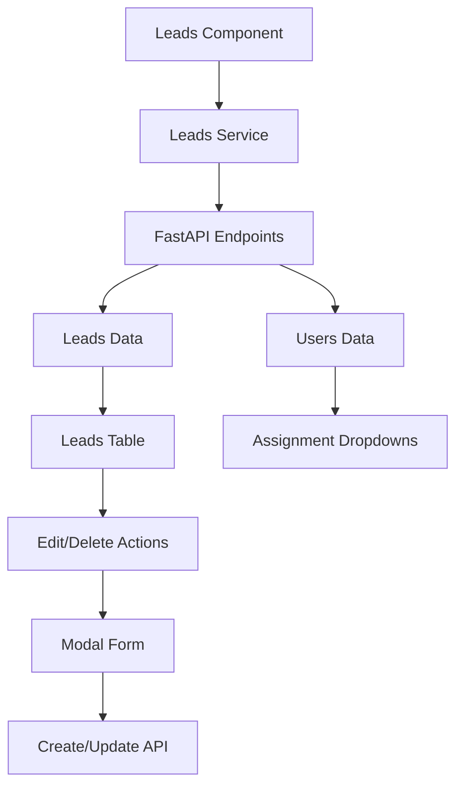

# Leads Management Implementation Documentation

This document explains the comprehensive Leads page implementation with table management, modal forms, search & filtering, and user assignment functionality.

## Overview

The Leads page provides complete lead management capabilities including viewing, creating, editing, deleting, and assigning leads with real-time data from FastAPI endpoints.

## Features

### 📊 **Leads Table**
- **Real-time Data**: Fetches leads from `/api/leads` endpoint
- **Responsive Design**: Mobile-friendly table with horizontal scroll
- **Status Indicators**: Color-coded status badges
- **Action Buttons**: Edit and delete actions for each lead
- **User Assignment**: Inline dropdown for assigning leads to users

### 🔍 **Search & Filtering**
- **Text Search**: Search by name, email, or company
- **Status Filter**: Filter by lead status (New, Contacted, Qualified, etc.)
- **Source Filter**: Filter by lead source (Website, Referral, Email, etc.)
- **Real-time Updates**: Filters apply automatically with debouncing

### ➕ **Add/Edit Lead Modal**
- **Modal Form**: Beautiful Tailwind modal with form validation
- **Dual Mode**: Add new leads or edit existing ones
- **Form Validation**: Client-side validation with error messages
- **User Assignment**: Dropdown to assign leads to users
- **Status Management**: Select lead status and source

### 👤 **User Assignment**
- **Inline Assignment**: Dropdown in table for quick assignment
- **User Dropdown**: Fetches users from `/api/users` endpoint
- **Real-time Updates**: Assignment changes reflect immediately
- **Unassigned Option**: Option to unassign leads

## Architecture

### Components

```
Leads.jsx
├── Page Header with Add Button
├── Search & Filter Controls
├── Leads Data Table
├── Add/Edit Lead Modal
└── User Assignment Dropdowns
```

### Data Flow



## API Integration

### Leads Service (`leadsService.js`)

#### Core Endpoints
```javascript
// Get all leads with filtering
GET /api/leads?search=term&status=new&source=website

// Get single lead
GET /api/leads/{lead_id}

// Create new lead
POST /api/leads

// Update existing lead
PUT /api/leads/{lead_id}

// Delete lead
DELETE /api/leads/{lead_id}

// Assign lead to user
PUT /api/leads/{lead_id}/assign

// Get lead statistics
GET /api/leads/stats

// Get all users
GET /api/users
```

### Data Structure

#### Lead Object
```javascript
{
  id: "uuid",
  name: "John Smith",
  email: "john@example.com",
  phone: "+1234567890",
  company: "Acme Corp",
  status: "new", // new, contacted, qualified, proposal, closed_won, closed_lost
  source: "website", // website, referral, email, social, phone, other
  notes: "Additional notes",
  assigned_to: "user_id",
  created_at: "2024-01-15T10:30:00Z"
}
```

#### User Object
```javascript
{
  id: "uuid",
  full_name: "Sarah Johnson",
  email: "sarah@company.com",
  role: "user" // user, manager, admin
}
```

## UI Components

### Leads Table

#### Table Structure
```jsx
<table className="min-w-full divide-y divide-gray-200">
  <thead className="bg-gray-50">
    <tr>
      <th>Lead</th>
      <th>Company</th>
      <th>Status</th>
      <th>Source</th>
      <th>Assigned To</th>
      <th>Created</th>
      <th>Actions</th>
    </tr>
  </thead>
  <tbody>
    {leads.map(lead => (
      <tr key={lead.id}>
        {/* Lead data cells */}
      </tr>
    ))}
  </tbody>
</table>
```

#### Status Badges
```javascript
const getStatusColor = (status) => {
  switch (status) {
    case 'new': return 'bg-green-100 text-green-800';
    case 'contacted': return 'bg-blue-100 text-blue-800';
    case 'qualified': return 'bg-yellow-100 text-yellow-800';
    case 'proposal': return 'bg-purple-100 text-purple-800';
    case 'closed_won': return 'bg-green-100 text-green-800';
    case 'closed_lost': return 'bg-red-100 text-red-800';
    default: return 'bg-gray-100 text-gray-800';
  }
};
```

### Search & Filter Controls

#### Search Input
```jsx
<div className="relative">
  <MagnifyingGlassIcon className="absolute left-3 top-1/2 transform -translate-y-1/2 h-5 w-5 text-gray-400" />
  <input
    type="text"
    placeholder="Search leads..."
    className="input pl-10"
    value={searchTerm}
    onChange={(e) => setSearchTerm(e.target.value)}
  />
</div>
```

#### Filter Dropdowns
```jsx
<select
  className="input"
  value={filterStatus}
  onChange={(e) => setFilterStatus(e.target.value)}
>
  <option value="all">All Status</option>
  {statusOptions.map(option => (
    <option key={option.value} value={option.value}>
      {option.label}
    </option>
  ))}
</select>
```

### Add/Edit Lead Modal

#### Modal Structure
```jsx
<div className="fixed inset-0 z-50 overflow-y-auto">
  <div className="flex items-center justify-center min-h-screen">
    <div className="fixed inset-0 bg-gray-500 bg-opacity-75" />
    <div className="inline-block align-bottom bg-white rounded-lg shadow-xl">
      <form onSubmit={handleSubmit}>
        {/* Form fields */}
        <div className="bg-white px-4 pt-5 pb-4">
          {/* Form content */}
        </div>
        <div className="bg-gray-50 px-4 py-3 sm:flex sm:flex-row-reverse">
          {/* Action buttons */}
        </div>
      </form>
    </div>
  </div>
</div>
```

#### Form Fields
- **Name** (required): Text input with validation
- **Email** (required): Email input with format validation
- **Phone**: Tel input for phone numbers
- **Company** (required): Text input with validation
- **Status**: Dropdown with predefined options
- **Source**: Dropdown with predefined options
- **Assigned To**: Dropdown populated with users
- **Notes**: Textarea for additional information

### User Assignment Dropdown

#### Inline Assignment
```jsx
<select
  value={lead.assigned_to || ''}
  onChange={(e) => handleAssignLead(lead.id, e.target.value)}
  className="text-sm border-0 bg-transparent focus:ring-0 focus:outline-none"
>
  <option value="">Unassigned</option>
  {users.map(user => (
    <option key={user.id} value={user.id}>
      {user.full_name}
    </option>
  ))}
</select>
```

## State Management

### Component State
```javascript
const [leads, setLeads] = useState([]);
const [users, setUsers] = useState([]);
const [isLoading, setIsLoading] = useState(true);
const [error, setError] = useState(null);

// Search and filter states
const [searchTerm, setSearchTerm] = useState('');
const [filterStatus, setFilterStatus] = useState('all');
const [filterSource, setFilterSource] = useState('all');

// Modal states
const [isModalOpen, setIsModalOpen] = useState(false);
const [isEditMode, setIsEditMode] = useState(false);
const [selectedLead, setSelectedLead] = useState(null);
const [isSubmitting, setIsSubmitting] = useState(false);

// Form states
const [formData, setFormData] = useState({
  name: '',
  email: '',
  phone: '',
  company: '',
  status: 'new',
  source: 'website',
  notes: '',
  assigned_to: ''
});
const [formErrors, setFormErrors] = useState({});
```

### Data Fetching
```javascript
const fetchLeads = async () => {
  try {
    const params = {};
    if (searchTerm) params.search = searchTerm;
    if (filterStatus !== 'all') params.status = filterStatus;
    if (filterSource !== 'all') params.source = filterSource;
    
    const result = await leadsService.getLeads(params);
    if (result.success) {
      setLeads(result.data.leads || []);
    } else {
      setError(result.error);
    }
  } catch (error) {
    setError('Failed to fetch leads');
  } finally {
    setIsLoading(false);
  }
};
```

## Form Validation

### Client-side Validation
```javascript
const validateForm = () => {
  const errors = {};
  
  if (!formData.name.trim()) {
    errors.name = 'Name is required';
  }
  
  if (!formData.email.trim()) {
    errors.email = 'Email is required';
  } else if (!/\S+@\S+\.\S+/.test(formData.email)) {
    errors.email = 'Email is invalid';
  }
  
  if (!formData.company.trim()) {
    errors.company = 'Company is required';
  }
  
  setFormErrors(errors);
  return Object.keys(errors).length === 0;
};
```

### Error Display
```jsx
{formErrors.name && (
  <p className="mt-1 text-sm text-red-600">{formErrors.name}</p>
)}
```

## CRUD Operations

### Create Lead
```javascript
const handleSubmit = async (e) => {
  e.preventDefault();
  
  if (!validateForm()) return;
  
  setIsSubmitting(true);
  
  try {
    let result;
    if (isEditMode) {
      result = await leadsService.updateLead(selectedLead.id, formData);
    } else {
      result = await leadsService.createLead(formData);
    }
    
    if (result.success) {
      setIsModalOpen(false);
      fetchLeads();
    } else {
      setFormErrors({ submit: result.error });
    }
  } catch (error) {
    setFormErrors({ submit: 'An unexpected error occurred' });
  } finally {
    setIsSubmitting(false);
  }
};
```

### Update Lead
```javascript
const handleEditLead = (lead) => {
  setIsEditMode(true);
  setSelectedLead(lead);
  setFormData({
    name: lead.name || '',
    email: lead.email || '',
    phone: lead.phone || '',
    company: lead.company || '',
    status: lead.status || 'new',
    source: lead.source || 'website',
    notes: lead.notes || '',
    assigned_to: lead.assigned_to || ''
  });
  setFormErrors({});
  setIsModalOpen(true);
};
```

### Delete Lead
```javascript
const handleDeleteLead = async (leadId) => {
  if (!window.confirm('Are you sure you want to delete this lead?')) {
    return;
  }

  try {
    const result = await leadsService.deleteLead(leadId);
    if (result.success) {
      setLeads(leads.filter(lead => lead.id !== leadId));
    } else {
      setError(result.error);
    }
  } catch (error) {
    setError('Failed to delete lead');
  }
};
```

### Assign Lead
```javascript
const handleAssignLead = async (leadId, userId) => {
  try {
    const result = await leadsService.assignLead(leadId, userId);
    if (result.success) {
      setLeads(leads.map(lead => 
        lead.id === leadId 
          ? { ...lead, assigned_to: userId }
          : lead
      ));
    } else {
      setError(result.error);
    }
  } catch (error) {
    setError('Failed to assign lead');
  }
};
```

## Search & Filtering

### Debounced Search
```javascript
useEffect(() => {
  const timeoutId = setTimeout(() => {
    fetchLeads();
  }, 300);
  return () => clearTimeout(timeoutId);
}, [searchTerm, filterStatus, filterSource]);
```

### Filter Parameters
```javascript
const params = {};
if (searchTerm) params.search = searchTerm;
if (filterStatus !== 'all') params.status = filterStatus;
if (filterSource !== 'all') params.source = filterSource;
```

## Error Handling

### Loading States
```jsx
if (isLoading) {
  return (
    <div className="flex items-center justify-center h-64">
      <div className="text-center">
        <div className="animate-spin rounded-full h-12 w-12 border-b-2 border-primary-600 mx-auto"></div>
        <p className="mt-4 text-gray-600">Loading leads...</p>
      </div>
    </div>
  );
}
```

### Error Display
```jsx
{error && (
  <div className="bg-red-50 border border-red-200 rounded-lg p-4">
    <div className="flex">
      <ExclamationTriangleIcon className="h-5 w-5 text-red-400" />
      <div className="ml-3">
        <p className="text-sm text-red-800">{error}</p>
      </div>
    </div>
  </div>
)}
```

## Responsive Design

### Mobile Optimization
- **Horizontal Scroll**: Table scrolls horizontally on mobile
- **Touch-friendly**: Large tap targets for buttons
- **Responsive Modal**: Modal adapts to screen size
- **Stacked Filters**: Filters stack vertically on mobile

### Grid Layouts
```css
/* Filter controls */
flex-col sm:flex-row gap-4

/* Form fields */
grid-cols-2 gap-4

/* Action buttons */
flex items-center justify-end space-x-2
```

## Performance Optimizations

### Efficient Updates
- **Local State Updates**: Immediate UI updates for better UX
- **Debounced Search**: Prevents excessive API calls
- **Conditional Rendering**: Only render when data is available
- **Error Boundaries**: Graceful error handling

### Data Management
- **Parallel Requests**: Fetch leads and users simultaneously
- **Optimistic Updates**: Update UI before API confirmation
- **Error Recovery**: Retry failed operations
- **Loading States**: User feedback during operations

## Testing

### Manual Testing Checklist
- [ ] **Data Loading**: Verify leads load correctly
- [ ] **Search Functionality**: Test text search across fields
- [ ] **Filter Operations**: Test status and source filters
- [ ] **Add Lead**: Test creating new leads
- [ ] **Edit Lead**: Test updating existing leads
- [ ] **Delete Lead**: Test lead deletion with confirmation
- [ ] **User Assignment**: Test assigning/unassigning leads
- [ ] **Form Validation**: Test required field validation
- [ ] **Error Handling**: Test error states and recovery
- [ ] **Responsive Design**: Test on different screen sizes

### Automated Testing
Consider implementing:
- **Unit Tests**: Component rendering and state management
- **Integration Tests**: API communication and CRUD operations
- **Form Tests**: Validation and submission logic
- **E2E Tests**: Complete user workflows

## Future Enhancements

### Planned Features
1. **Bulk Operations**: Select multiple leads for bulk actions
2. **Advanced Filters**: Date range, custom fields, tags
3. **Export Functionality**: Export leads to CSV/Excel
4. **Lead Import**: Import leads from external sources
5. **Lead Scoring**: Automatic lead scoring system
6. **Lead Timeline**: Activity history for each lead
7. **Email Integration**: Send emails directly from lead records
8. **Lead Conversion**: Convert leads to deals/contacts

### Performance Improvements
1. **Virtual Scrolling**: Handle large lead lists efficiently
2. **Data Caching**: Cache frequently accessed data
3. **Infinite Scroll**: Load leads progressively
4. **Real-time Updates**: WebSocket integration for live updates
5. **Offline Support**: Work offline with sync capabilities

This Leads implementation provides a comprehensive, user-friendly interface for managing sales leads with professional design, robust functionality, and excellent user experience.
