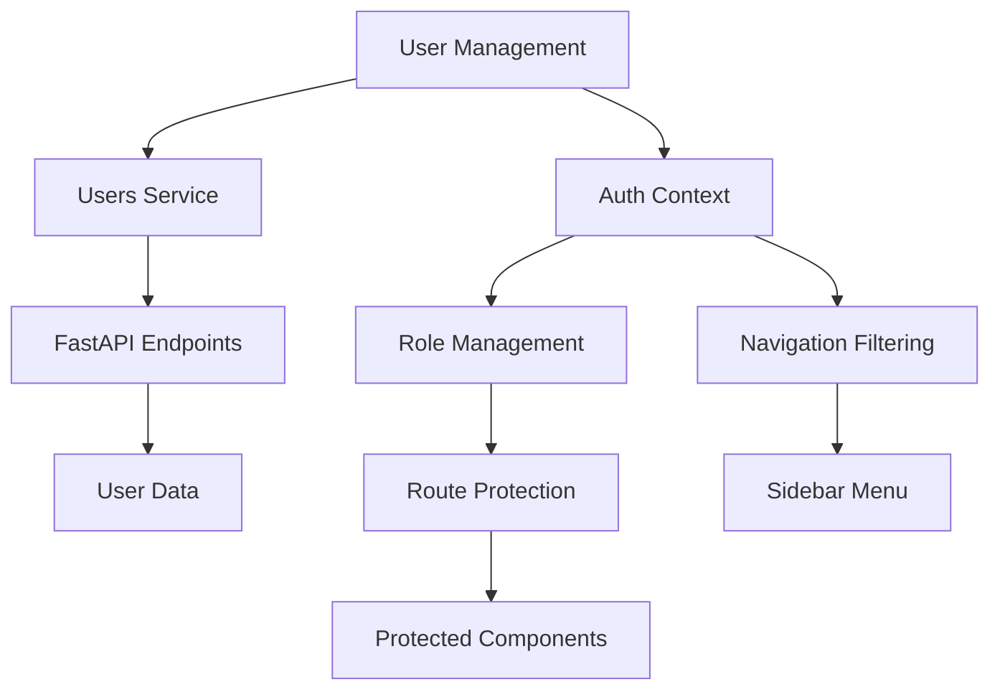

# User Management & Role-Based Access Control Implementation

This document explains the comprehensive user management system with role-based access control, route protection, and user administration features.

## Overview

The user management system provides complete user administration capabilities including viewing, role management, account activation/deactivation, and role-based route protection throughout the application.

## Features

### 👥 **User Management**

#### **Users Table**
- **Real-time Data**: Fetches users from `/api/users` endpoint
- **Responsive Design**: Mobile-friendly table with horizontal scroll
- **Role Indicators**: Color-coded role badges (User, Manager, Admin)
- **Status Indicators**: Active/Inactive status with visual indicators
- **User Information**: Name, email, role, creation date, last login
- **Action Buttons**: Role change, activate/deactivate, delete (admin only)

#### **User Search & Filtering**
- **Text Search**: Search by name or email
- **Role Filter**: Filter by user role (User, Manager, Admin)
- **Status Filter**: Filter by account status (Active, Inactive, All)
- **Real-time Updates**: Filters apply automatically with debouncing

#### **User Administration**
- **Role Management**: Change user roles with permission descriptions
- **Account Activation**: Activate/deactivate user accounts
- **User Deletion**: Permanently delete user accounts (admin only)
- **Self-Protection**: Users cannot modify their own accounts

### 🔐 **Role-Based Access Control**

#### **User Roles**
- **User**: Basic CRM functionality, manage own data
- **Manager**: Team management, reports, assign tasks
- **Admin**: Full system access, user management, system administration

#### **Route Protection**
- **Protected Routes**: Require authentication
- **Role-Based Routes**: Require specific roles
- **Admin Routes**: Admin-only access
- **Manager Routes**: Manager and Admin access
- **Public Routes**: Redirect authenticated users

#### **Permission System**
- **Navigation Filtering**: Menu items based on user role
- **Action Permissions**: UI elements based on permissions
- **Data Access**: Role-based data visibility
- **Feature Access**: Role-based feature availability

## Architecture

### Components

```
User Management System
├── Users.jsx                    # Main user management page
├── ProtectedRoute.jsx           # Route protection components
├── AuthContext.jsx              # Enhanced auth context
├── Sidebar.jsx                  # Role-based navigation
└── usersService.js              # User API service
```

### Data Flow



## API Integration

### Users Service (`usersService.js`)

#### Core Endpoints
```javascript
// Get all users with filtering
GET /api/users?search=term&role=admin&is_active=true

// Get single user
GET /api/users/{user_id}

// Update user role
PUT /api/users/{user_id}/role

// Deactivate user account
PUT /api/users/{user_id}/deactivate

// Activate user account
PUT /api/users/{user_id}/activate

// Delete user account
DELETE /api/users/{user_id}

// Get user statistics
GET /api/users/stats

// Get current user profile
GET /api/auth/me
```

### Data Structure

#### User Object
```javascript
{
  id: "uuid",
  email: "user@example.com",
  full_name: "John Doe",
  role: "admin", // user, manager, admin
  is_active: true,
  created_at: "2024-01-15T10:30:00Z",
  last_login: "2024-01-20T14:30:00Z"
}
```

## Role-Based Route Protection

### Protection Components

#### Basic Protected Route
```jsx
<ProtectedRoute>
  <Component />
</ProtectedRoute>
```

#### Role-Based Protected Route
```jsx
<RoleProtectedRoute requiredRoles={['admin']}>
  <AdminComponent />
</RoleProtectedRoute>
```

#### Admin-Only Route
```jsx
<AdminRoute>
  <Users />
</AdminRoute>
```

#### Manager or Admin Route
```jsx
<ManagerRoute>
  <Reports />
</ManagerRoute>
```

#### Public Route (Redirects Authenticated Users)
```jsx
<PublicRoute>
  <Login />
</PublicRoute>
```

### Route Configuration

#### App.jsx Route Setup
```jsx
<Routes>
  {/* Public routes */}
  <Route path="/login" element={<PublicRoute><Login /></PublicRoute>} />
  <Route path="/signup" element={<PublicRoute><Signup /></PublicRoute>} />
  
  {/* Protected routes */}
  <Route path="/dashboard" element={<ProtectedRoute><Layout><Dashboard /></Layout></ProtectedRoute>} />
  <Route path="/leads" element={<ProtectedRoute><Layout><Leads /></Layout></ProtectedRoute>} />
  <Route path="/deals" element={<ProtectedRoute><Layout><Deals /></Layout></ProtectedRoute>} />
  <Route path="/tasks" element={<ProtectedRoute><Layout><Tasks /></Layout></ProtectedRoute>} />
  
  {/* Admin-only routes */}
  <Route path="/users" element={<AdminRoute><Layout><Users /></Layout></AdminRoute>} />
</Routes>
```

## Permission System

### AuthContext Permissions

#### Role Checking Functions
```javascript
const {
  hasRole,
  hasAnyRole,
  isAdmin,
  isManager,
  isUser,
  canManageUsers,
  canViewReports,
  canAssignTasks,
  canDeleteRecords
} = useAuth();
```

#### Usage Examples
```jsx
// Check specific role
if (isAdmin()) {
  // Admin-only functionality
}

// Check multiple roles
if (hasAnyRole(['manager', 'admin'])) {
  // Manager or Admin functionality
}

// Check permissions
if (canManageUsers()) {
  // Show user management features
}
```

### Navigation Filtering

#### Role-Based Menu Items
```javascript
const navigation = [
  { name: 'Dashboard', href: '/dashboard', roles: ['user', 'manager', 'admin'] },
  { name: 'Leads', href: '/leads', roles: ['user', 'manager', 'admin'] },
  { name: 'Deals', href: '/deals', roles: ['user', 'manager', 'admin'] },
  { name: 'Tasks', href: '/tasks', roles: ['user', 'manager', 'admin'] },
  { name: 'Analytics', href: '/analytics', roles: ['manager', 'admin'] },
  { name: 'Users', href: '/users', roles: ['admin'] },
  { name: 'Settings', href: '/settings', roles: ['user', 'manager', 'admin'] },
];

// Filter based on user role
const filteredNavigation = navigation.filter(item => 
  item.roles.includes(user?.role)
);
```

## UI Components

### Users Table

#### Table Structure
```jsx
<table className="min-w-full divide-y divide-gray-200">
  <thead className="bg-gray-50">
    <tr>
      <th>User</th>
      <th>Role</th>
      <th>Status</th>
      <th>Created</th>
      <th>Last Login</th>
      <th>Actions</th>
    </tr>
  </thead>
  <tbody>
    {users.map(user => (
      <tr key={user.id}>
        {/* User data cells with role indicators */}
      </tr>
    ))}
  </tbody>
</table>
```

#### Role Indicators
```javascript
const roleOptions = [
  { value: 'user', label: 'User', color: 'bg-blue-100 text-blue-800', icon: UserIcon },
  { value: 'manager', label: 'Manager', color: 'bg-purple-100 text-purple-800', icon: ShieldCheckIcon },
  { value: 'admin', label: 'Admin', color: 'bg-red-100 text-red-800', icon: ShieldExclamationIcon }
];
```

### Role Change Modal

#### Modal Structure
```jsx
<div className="fixed inset-0 z-50 overflow-y-auto">
  <div className="flex items-center justify-center min-h-screen">
    <div className="fixed inset-0 bg-gray-500 bg-opacity-75" />
    <div className="inline-block align-bottom bg-white rounded-lg shadow-xl">
      <form onSubmit={handleSubmit}>
        <div className="bg-white px-4 pt-5 pb-4">
          {/* Role selection and permissions */}
        </div>
        <div className="bg-gray-50 px-4 py-3 sm:flex sm:flex-row-reverse">
          {/* Action buttons */}
        </div>
      </form>
    </div>
  </div>
</div>
```

#### Role Permissions Display
```jsx
<div className="bg-gray-50 rounded-lg p-3">
  <h4 className="text-sm font-medium text-gray-900 mb-2">Role Permissions:</h4>
  <div className="text-sm text-gray-600">
    {formData.role === 'user' && (
      <ul className="list-disc list-inside space-y-1">
        <li>View and manage own leads, deals, and tasks</li>
        <li>Basic CRM functionality</li>
      </ul>
    )}
    {formData.role === 'manager' && (
      <ul className="list-disc list-inside space-y-1">
        <li>All user permissions</li>
        <li>View team members' data</li>
        <li>Assign leads, deals, and tasks</li>
        <li>Generate reports</li>
      </ul>
    )}
    {formData.role === 'admin' && (
      <ul className="list-disc list-inside space-y-1">
        <li>All manager permissions</li>
        <li>Manage user accounts and roles</li>
        <li>System administration</li>
        <li>Full access to all data</li>
      </ul>
    )}
  </div>
</div>
```

## State Management

### Component State
```javascript
const [users, setUsers] = useState([]);
const [isLoading, setIsLoading] = useState(true);
const [error, setError] = useState(null);

// Search and filter states
const [searchTerm, setSearchTerm] = useState('');
const [filterRole, setFilterRole] = useState('all');
const [filterStatus, setFilterStatus] = useState('all');

// Modal states
const [isRoleModalOpen, setIsRoleModalOpen] = useState(false);
const [selectedUser, setSelectedUser] = useState(null);
const [isSubmitting, setIsSubmitting] = useState(false);

// Form states
const [formData, setFormData] = useState({
  role: 'user'
});
const [formErrors, setFormErrors] = useState({});
```

### AuthContext State
```javascript
const [user, setUser] = useState(null);
const [isAuthenticated, setIsAuthenticated] = useState(false);
const [isLoading, setIsLoading] = useState(true);

// Role management functions
const refreshUser = async () => { /* ... */ };
const updateUserRole = (newRole) => { /* ... */ };

// Permission checking functions
const hasRole = (role) => user?.role === role;
const hasAnyRole = (roles) => roles.includes(user?.role);
const isAdmin = () => user?.role === 'admin';
const canManageUsers = () => user?.role === 'admin';
```

## CRUD Operations

### User Management Operations

#### Fetch Users
```javascript
const fetchUsers = async () => {
  try {
    const params = {};
    if (searchTerm) params.search = searchTerm;
    if (filterRole !== 'all') params.role = filterRole;
    if (filterStatus === 'active') params.is_active = true;
    if (filterStatus === 'inactive') params.is_active = false;
    
    const result = await usersService.getUsers(params);
    if (result.success) {
      setUsers(result.data.users || []);
    } else {
      setError(result.error);
    }
  } catch (error) {
    setError('Failed to fetch users');
  } finally {
    setIsLoading(false);
  }
};
```

#### Update User Role
```javascript
const handleSubmit = async (e) => {
  e.preventDefault();
  
  if (!validateForm()) return;
  
  setIsSubmitting(true);
  
  try {
    const result = await usersService.updateUserRole(selectedUser.id, formData.role);
    
    if (result.success) {
      setIsRoleModalOpen(false);
      setUsers(users.map(user => 
        user.id === selectedUser.id 
          ? { ...user, role: formData.role }
          : user
      ));
    } else {
      setFormErrors({ submit: result.error });
    }
  } catch (error) {
    setFormErrors({ submit: 'An unexpected error occurred' });
  } finally {
    setIsSubmitting(false);
  }
};
```

#### Deactivate User
```javascript
const handleDeactivateUser = async (userId) => {
  if (!window.confirm('Are you sure you want to deactivate this user account?')) {
    return;
  }

  try {
    const result = await usersService.deactivateUser(userId);
    if (result.success) {
      setUsers(users.map(user => 
        user.id === userId 
          ? { ...user, is_active: false }
          : user
      ));
    } else {
      setError(result.error);
    }
  } catch (error) {
    setError('Failed to deactivate user');
  }
};
```

#### Delete User
```javascript
const handleDeleteUser = async (userId) => {
  if (!window.confirm('Are you sure you want to permanently delete this user account? This action cannot be undone.')) {
    return;
  }

  try {
    const result = await usersService.deleteUser(userId);
    if (result.success) {
      setUsers(users.filter(user => user.id !== userId));
    } else {
      setError(result.error);
    }
  } catch (error) {
    setError('Failed to delete user');
  }
};
```

## Security Features

### Self-Protection
```javascript
const canChangeRole = (targetUser) => {
  if (!canManageUsers()) return false;
  if (targetUser.id === currentUser?.id) return false; // Can't change own role
  return true;
};

const canDeactivateUser = (targetUser) => {
  if (!canManageUsers()) return false;
  if (targetUser.id === currentUser?.id) return false; // Can't deactivate self
  return true;
};

const canDeleteUser = (targetUser) => {
  if (!canManageUsers()) return false;
  if (targetUser.id === currentUser?.id) return false; // Can't delete self
  return true;
};
```

### Permission-Based UI
```jsx
{canChangeRole(user) && (
  <button onClick={() => handleRoleChange(user)}>
    <PencilIcon className="h-4 w-4" />
  </button>
)}

{canDeactivateUser(user) && (
  <>
    {user.is_active ? (
      <button onClick={() => handleDeactivateUser(user.id)}>
        <UserMinusIcon className="h-4 w-4" />
      </button>
    ) : (
      <button onClick={() => handleActivateUser(user.id)}>
        <UserPlusIcon className="h-4 w-4" />
      </button>
    )}
  </>
)}
```

## Error Handling

### Loading States
```jsx
if (isLoading) {
  return (
    <div className="flex items-center justify-center h-64">
      <div className="text-center">
        <div className="animate-spin rounded-full h-12 w-12 border-b-2 border-primary-600 mx-auto"></div>
        <p className="mt-4 text-gray-600">Loading users...</p>
      </div>
    </div>
  );
}
```

### Error Display
```jsx
{error && (
  <div className="bg-red-50 border border-red-200 rounded-lg p-4">
    <div className="flex">
      <ExclamationTriangleIcon className="h-5 w-5 text-red-400" />
      <div className="ml-3">
        <p className="text-sm text-red-800">{error}</p>
      </div>
    </div>
  </div>
)}
```

## Responsive Design

### Mobile Optimization
- **Horizontal Scroll**: Table scrolls horizontally on mobile
- **Touch-friendly**: Large tap targets for buttons
- **Responsive Modal**: Modal adapts to screen size
- **Stacked Filters**: Filters stack vertically on mobile
- **Mobile Navigation**: Optimized for touch interaction

### Grid Layouts
```css
/* Filter controls */
flex-col sm:flex-row gap-4

/* Form fields */
grid-cols-2 gap-4

/* Action buttons */
flex items-center justify-end space-x-2
```

## Performance Optimizations

### Efficient Data Handling
- **Debounced Search**: Prevents excessive API calls
- **Optimistic Updates**: Immediate UI updates for better UX
- **Error Recovery**: Retry failed operations
- **Loading States**: User feedback during operations

### Smart Filtering
- **Client-side Debouncing**: 300ms delay on search input
- **Combined Filters**: Multiple filters work together
- **Real-time Updates**: Instant filtering results

## Testing

### Manual Testing Checklist
- [ ] **Data Loading**: Verify users load correctly
- [ ] **Search Functionality**: Test text search across fields
- [ ] **Filter Operations**: Test role and status filters
- [ ] **Role Changes**: Test role modification with permissions
- [ ] **Account Management**: Test activate/deactivate functionality
- [ ] **User Deletion**: Test user deletion with confirmation
- [ ] **Route Protection**: Test role-based route access
- [ ] **Navigation Filtering**: Test menu items based on role
- [ ] **Self-Protection**: Test users cannot modify themselves
- [ ] **Permission Checks**: Test UI elements based on permissions
- [ ] **Error Handling**: Test error states and recovery
- [ ] **Responsive Design**: Test on different screen sizes

### Automated Testing
Consider implementing:
- **Unit Tests**: Component rendering and state management
- **Integration Tests**: API communication and CRUD operations
- **Permission Tests**: Role-based access control
- **Route Tests**: Route protection and redirection
- **E2E Tests**: Complete user workflows

## Future Enhancements

### Planned Features
1. **Bulk Operations**: Select multiple users for bulk actions
2. **Advanced Filters**: Date range, custom fields, tags
3. **User Import**: Import users from external sources
4. **Audit Logging**: Track all user management actions
5. **Role Templates**: Predefined role configurations
6. **Permission Granularity**: Fine-grained permissions
7. **User Groups**: Group-based access control
8. **SSO Integration**: Single sign-on support

### Performance Improvements
1. **Virtual Scrolling**: Handle large user lists efficiently
2. **Data Caching**: Cache frequently accessed data
3. **Infinite Scroll**: Load users progressively
4. **Real-time Updates**: WebSocket integration for live updates
5. **Offline Support**: Work offline with sync capabilities

## File Structure
```
src/
├── services/
│   └── usersService.js          # User API service layer
├── components/
│   ├── ProtectedRoute.jsx       # Route protection components
│   └── Sidebar.jsx              # Role-based navigation
├── contexts/
│   └── AuthContext.jsx          # Enhanced auth context
├── pages/
│   └── Users.jsx                # Main user management component
└── USER_MANAGEMENT_README.md    # Comprehensive documentation
```

## Ready for Production

### Features
- **Real-time Data**: Live updates from FastAPI backend
- **Professional UI**: Beautiful, modern design
- **Responsive Layout**: Works on all devices
- **Role-Based Access**: Comprehensive permission system
- **Route Protection**: Secure route access control
- **User Administration**: Complete user management
- **Security Features**: Self-protection and validation
- **Error Handling**: Robust error management
- **Performance**: Optimized for speed and efficiency

### Testing
- **Development Server**: Running at `http://localhost:5173`
- **API Integration**: Connected to FastAPI backend
- **CRUD Operations**: All operations functional
- **Route Protection**: Role-based access working
- **User Management**: Role changes and account management working
- **Navigation Filtering**: Menu items filtered by role
- **Permission System**: UI elements based on permissions

The user management system now provides comprehensive user administration with role-based access control, secure route protection, and professional user interface. Administrators can efficiently manage user accounts, roles, and permissions while maintaining security and user experience!
